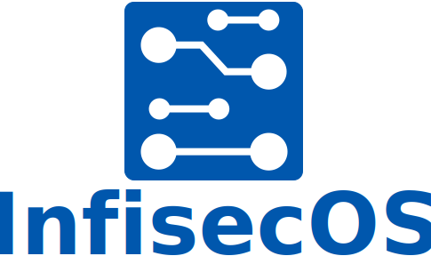

<p align="center">
    <br>
    一个专注于 AIoT 领域的安全操作系统<br/>
    <br/>
</p>

[English](README.md) | 中文版

# 简介

本仓库是使用 [Docusaurus](https://docusaurus.io/) 构建 SecOS 的文档的源码仓库。Docusaurus 是有 Meta 开源的基于 React 开发的一个用于创建、维护和部署静态网站的网站生成工具。

## 开发

Docusaurus 实际上是一组 Node.js 包，因此，本文档实际上是一个 Node.js 应用。所以，首先需要确保正确安装了 Node.js 环境。

1. 使用 `yarn` 作为维护工具，默认的 Node.js 中并没有安装 `yarn`，因此，首先使用命令 `npm install -g yarn` 进行全局安装
2. 首次进行开发需要先试用命令 `yarn install` 安装所需的依赖包
3. 使用任意编辑器（推荐 VS Code）进行修改源码，编辑新文档（全部采用 Markdown 格式）
4. 通过命令 `yarn start` 将会在本地启动的开发服务器，并自动打开浏览器窗口预览整个网站

## 部署

目前，SecOS 的文档网站托管在了 GitHub Pages 上，仓库默认配置为通过 GitHub Action 进行部署，当把源码提交到仓库之后将自动触发 GitHub Action 进行部署。

> 也支持 `yarn deploy` 进行独立分支部署（需修改仓库配置后）
>  - Linux:
>    - 使用 SSH 方式:
>        ```
>        $ USE_SSH=true yarn deploy
>        ```
> 
>    - 不使用 SSH 方式:
> 
>        ```
>        $ GIT_USER=<Your GitHub username> yarn deploy
>        ```
>  - Windows PowerShell:
>    - 使用 SSH 方式:
> 
>        ```
>        $ cmd /C 'set "USE_SSH=true" && yarn deploy'
>        ```
> 
>    - 不使用 SSH 方式:
> 
>        ```
>        $ cmd /C 'set "GIT_USER=<Your GitHub username>" && yarn deploy'
>        ```
