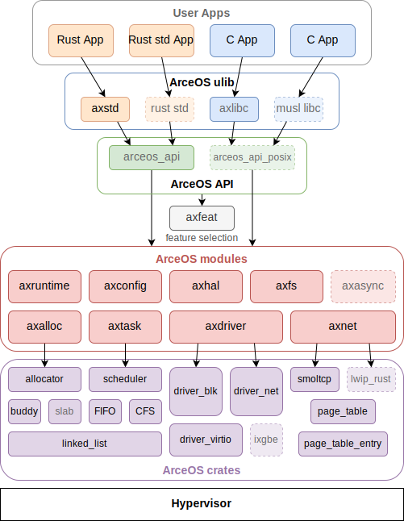
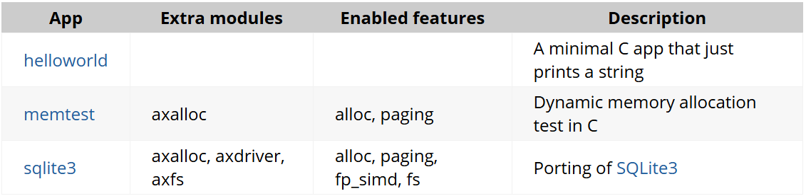

# Architecture

SecOS 是一个开源的、组件化的 Unikernel，以组合组件库的方式构建系统。

使用 Rust 语言开发，具有一下特点和功能:
-   CPU架构: x86_64，riscv64，aarch64
-   运行平台: QEMU pc-q35 (x86_64)，virt (riscv64/aarch64)
-   支持多线程: Multi-thread
-   调度算法: FIFO/RR/CFS scheduler
-   虚拟IO: VirtIO net/blk/gpu drivers
-   网络协议: TCP/UDP net stack using smoltcp
-   同步/互斥: Synchronization/Mutex
-   SMP调度: SMP scheduling with single run queue
-   文件系统: File system

SecOS 由 apps、crates、modules 组成
-  apps: 应用程序。它的运行需要依赖于modules组件库。
- modules: SecOS 的组件库。
-  crates: 通用的基础库，为 modules 实现提供支持。

## 组件划分

如果要让程序员在较短的时间内实现丰富多彩的操作系统，需要像应用程序一样，在软件栈的各个层次上，都有可以重用且接口比较明确的软件层组件。上面的概要设计还没有解决这样的问题。基于组件化设计的基本思路，整个操作系统可以按不同维度进行划分：

1.  硬件：硬件相关层与硬件无关层；
2.  主干与组件：不可拆分的紧耦合的核心部分与可拆分的具有一定独立性的组件部分

### 硬件相关层的层次划分
我们先看最下层，即硬件相关的软件层。通过对我们之前实现的操作系统驱动程序、处理器与内存相关的硬件操作函数的分析，我们发现与硬件相关的内核代码在功能和组成上其实可以进一步细化成不同的层次和软件组成，形成主干部分和组件部分。

就像计算机系统的总体架构一样，硬件系统也分核心部分和外围部分，处理器是最核心部分，然后是属于次核心部分的内存，外围部分是连接处理器/内存的总线，以及各种外设。所以与硬件相关的内核代码也可进行类似划分，把与硬件相关的操作系统部分分为：

1.  内核主干（os-backbone）的核心部分，主要完成进程上下文切换、控制寄存器访问、处理器特权级切换、中断总体处理、时钟中断处理的硬件相关的代码；
    
2.  内核主干的次核心部分，主要完成基于页表的虚拟地址空间管理的相关代码；
    
3.  裸机组件 (baremetal-kits)模态的设备驱动：主要完成某外设（如 `UART`、`virtio-blk`）的基本硬件功能的设备驱动代码库，与具体计算机系统（如`virt machine`）和具体操作系统无关，可在没有操作系统功能的最小裸机执行环境下运行；
    
4.  内核组件（os-kits）模态的设备驱动：可直接调用裸机组件 (baremetal-kits)模态的设备驱动代码库，并结合具体计算机系统（如`virt machine`）的硬件配置信息（如外设控制寄存器的基址等），可驱动具体计算机中的外设。同时与操作系统中相关子系统对接（如块存储设备驱动内核组件与文件子系统内核组件对接），服务操作系统中上层软件栈的需求。
    
5.  裸机组件（baremetal-kits）模态的硬件平台（platform）驱动：管理各种外设的硬件平台（如PCI、PLIC）驱动库，与具体计算机系统（如`virt machine`）有关，但与具体操作系统无关，可在没有操作系统功能的最小裸机执行环境下运行；
    
6.  内核组件（os-kits）模态的硬件平台驱动：可直接调用裸机组件 (baremetal-kits)模态的硬件平台驱动代码库，同时与操作系统中相关内核组件（os-kits）模态的设备驱动对接，让设备驱动能正常工作。
    

其中进程和虚存相关的部分形成操作系统中与硬件相关的内核主干，而各种设备驱动和平台驱动是裸机组件 (baremetal-kits)或内核组件（os-kits）。

### 抽象资源管理层的层次划分
接下来我们看中间层，即抽象资源管理的软件层。这里的抽象有三个：进程（CPU抽象）、地址空间（内存抽象）、文件（存储与I/O抽象）。这些抽象是操作系统中的重要组成成分，与硬件相关层有直接的对应关系：

1.  进程组件对接硬件相关层的内核主干的核心部分；
2.  地址空间组件对接硬件相关层的内核主干的次核心部分；
3.  功能组件（functional-kits）模态的文件系统：在伪存储设备驱动（如内存模拟等）支持下，可以在实现与具体操作系统无关的文件系统库，可在用户态的最小用户态执行环境下运行；
4.  内核组件（os-kits）模态的文件系统：可直接调用功能组件（functional-kits）模态的文件系统库，并与内核组件（os-kits）模态的块设备驱动对接，服务系统调用相关的接口层。

其中进程组件与地址空间组件形成内核主干，而各种文件系统是功能组件（functional-kits）或内核组件（os-kits）。而系统调用接口层主要是对接抽象资源管理层，可以看成是抽象资源管理层面向应用的接口，也是内核主干的一部分。

## examples
examples 即直接面向用户的可执行程序，SecOS 在设计上可以同时支持 Rust 编程和 C 语言编程，并提供了如下所示的一些示例
-  Rust 应用

- C 应用

## modules
Modules 是 SecOS 的组件集合，它是与具体 OS 相关的。modules 下的模块是 SecOS 为了想要实现操作系统的必要功能而对 crates 的各种库组合和扩展后，更加接近用户应用层的抽象模块。
-   axalloc: SecOS 的全局内存分配器.
-   axconfig: SecOS 特定平台编译的常量和参数配置。
-   axdisplay: SecOS 的图形化模块。
-   axdriver: SecOS 的设备驱动模块。
-   axfs: SecOS 的文件系统模块。
-   axhal: SecOS硬件抽象层，为特定平台的操作提供统一的API。
-   axlog: SecOS 多个级别日志记录宏，包括：error、warn、info、debug、trace。
-   axnet: SecOS 的网络模块，包括：IpAddr、TcpSocket、UdpSocket、DnsSocket等。
-   axruntime: SecOS 的运行时库，是应用程序运行的基础环境。
-   axsync: SecOS 提供的同步操作模块，包括：Mutex、spin。
-   axtask: SecOS 的任务调度管理模块，包括：任务创建、调度、休眠、销毁等。

## crates
crates 是 Modules 实现提供更底层的支持，通用的基础库。crates 模块属于是系统无关的模块，这些库可以理解为构建一个操作系统所需要的底层共性，我们以松耦合，高抽象的方式开发这些库，目的是后续可以为别的系统复用。
-   allocator: 内存分配算法，包括：bitmap、buddy、slab。
-   arm_gic: ARM通用中断控制器 (GICv2) 。
-   arm_pl011: ARM串行通信接口，用于处理器和外部设备之间的串行通信 。
-   axerrno: SecOS的错误码定义。
-   axfs_devfs: SecOS的设备（Device）文件系统，是axfs_vfs一种实现。
-   axfs_ramfs: SecOS的内存（RAM）文件系统，是axfs_vfs一种实现。
-   axfs_vfs: SecOS的虚拟文件系统接口。
-   axio: no_std环境下的I/O traits 。
-   capability: Capability-based security 通过设置访问权限控制对系统资源的访问。
-   crate_interface: 提供一种在 crate 中定义接口（特征）的方法，其目的是解决循环依赖。
-   driver_block: 通用的块存储（磁盘）驱动程序的接口定义。
-   driver_common: SecOS的通用设备驱动接口定义，包括：disk、serial port、 ethernet card、GPU。
-   driver_display: 通用的图形设备驱动程序接口定义。
-   driver_net: 通用的网络设备 (NIC) 驱动程序定义。
-   driver_pci: 定义对PCI总线操作。
-   driver_virtio: 实现在driver_common定义的驱动。
-   flatten_objects: 为每个存储对象分配一个唯一的ID。
-   handler_table: 无锁的事件处理程序表。
-   kernel_guard: 利用RAII创建具有本地IRQ或禁用抢占的临界区，用于在内核中实现自旋锁。
-   lazy_init: 延迟初始化。
-   linked_list: 链表。
-   memory_addr: 提供理物理和虚拟地址操作的辅助函数。
-   page_table: 页表。
-   page_table_entry: 页表项。
-   percpu: per-CPU的数据结构。
-   percpu_macros: per-CPU的数据结构的宏实现。
-   ratio: 比率相关计算。
-   scheduler: 统一的调度算法接口，包括：cfs、fifo、round_robin。
-   slab_allocator: no_std 环境下的 Slab 分配器（一种内存管理算法）。
-   spinlock: no_std 环境下的自旋锁实现。
-   timer_list: 定时器，在计时器到期时触发。
-   tuple_for_each: 提供遍历tuple字段的宏和方法。
