# QuickStart

在 [infisecos-images](https://github.com/qclic/infisecos-images) 这个仓库中，我们提供了预编译的适用于飞腾派和树莓派 4B 开发版的镜像文件，可以快速体验 InfisecOS 的运行效果。

## 文件介绍

目录文件介绍如下：
```c
infisecos-images
├── README.md
├── README_CN.md
├── phytiumpi
│   ├── Image                                   # Linux Kernel 
│   ├── arceos.bin                              # arceos 镜像（不再需要，已经默认集成到了 infisecos-image）
│   ├── infisecos-image.img                     # 飞腾派开发板镜像
│   └── rootfs.cpio                             # rootfs used for initramfs
└── raspberrypi4                                # 其中的各文件含义同上
    ├── Image
    ├── arceos.bin
    ├── infisecos-image.img
    └── rootfs.cpio
```

## 烧写

首先使用 `git clone git@github.com:qclic/infisecos-images.git` 命令下载镜像文件，[infisecos-images](https://github.com/qclic/infisecos-images) 中提供的是 SD 卡镜像文件，因此，需要准备一张 SD 卡，将镜像烧写到 SD 卡来进行启动

### Linux
在 Linux 系统中，可以直接使用命令 `sudo dd iflag=sync oflag=sync bs=4M if=infisecos-image-phytiumpi.img of=/dev/sdb status=progress` 来进行烧写

- `if=` 指定输入文件，即我们要烧写的 `infisecos-image.img` 镜像文件。

- `of=` 指定输出设备，即我们的 SD 卡盘符。

- `bs=4M` 设置块大小为 4MB，这对于大型文件来说可以提高写入效率。

- `status=progress` 显示写入过程中的进度信息。

- `oflag=sync` 确保写入操作同步进行，数据更改立即被写入设备。

### Windows

在 Windows 系统中，有很多 GUI 程序可以用来烧写 SD 卡。对于飞腾派，可以使用 `Win32DiskImager2.0.1.8.exe`，对于树莓派，官方提供了一个名为 `Raspberry Pi Imager` 烧写工具

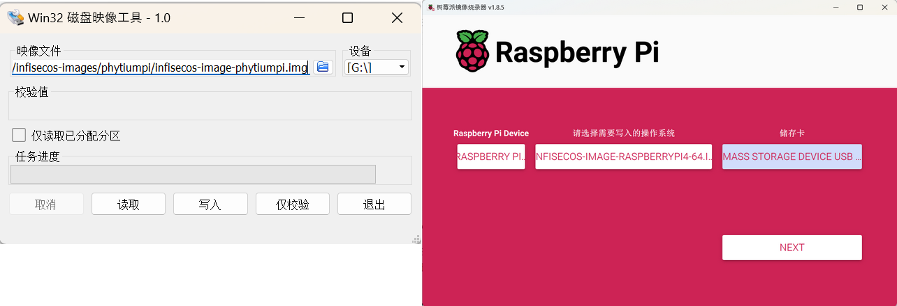

## 启动验证

将烧写好的 SD 卡插入到开发板中，然后上电启动。默认的用户为 root，没有密码。

### 处理终端输入太长后返回行头

默认生成的 InfisecOS 系统中，如果在终端输入内容太长时就会返回行开头，非常影响使用！这通常是由于 Buildroot 构建的 Linux 系统终端的缓冲区大小不足以处理太长的输入导致的。
1. 解决方法一：直接 `nano /etc/profile` 或其他用户配置文件，然后在其中添加 `export COLUMNS=200` 和 `export LINES=200`，重启后生效！
2. 解决方法二：每次登陆终端后，使用命令 `stty rows [number_of_rows] cols [number_of_columns]` 动态修改

### 加载 Jailhouse 驱动

Jailhouse 的驱动 `jailhouse.ko` 位于 `/lib/modules/5.10.0-openeuler/jailhouse/driver/` 目录中，默认是没有被加载进内核的。我们需要手动执行 `insmod /lib/modules/$(uname -r)/jailhouse/driver/jailhouse.ko` 或者 `modprobe jailhouse` 来进行加载，否则会报错 `opening /dev/jailhouse: No such file or directory`。

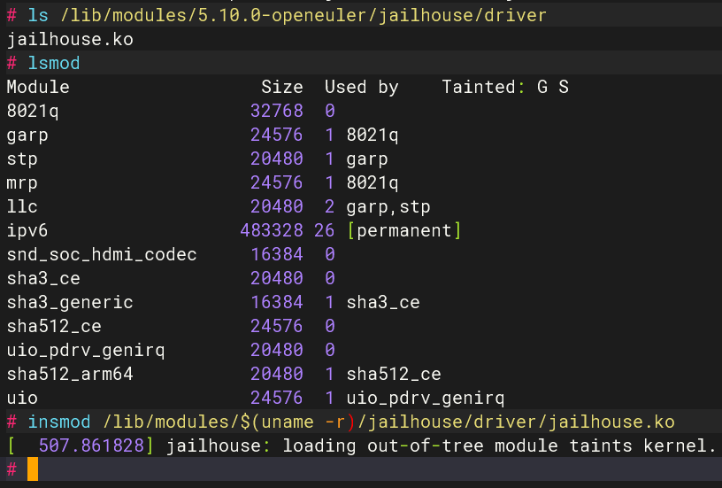

也可以配置一下开机自动加载，不过，虽然 Linux 在启动时加载 ko 的方式有很多，但是针对嵌入式的 Linux，很多方式都是不支持的。最简单有效的方法就通过修改启动过程的 rc 脚本。直接 `nano /etc/init.d/rcS`，然后在文件最后添加 `modprobe jailhouse` 即可

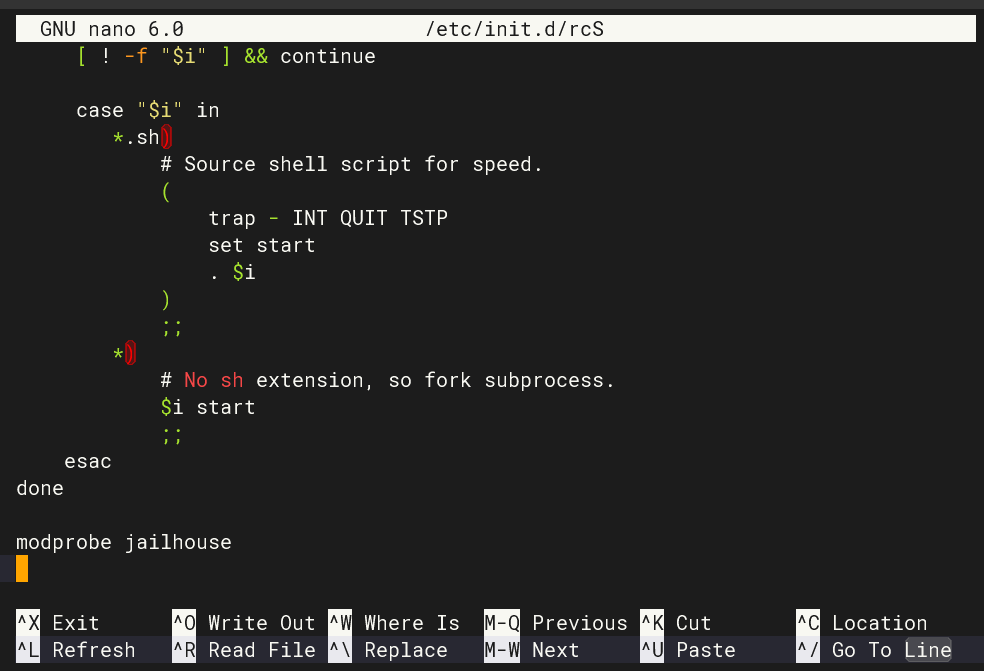

修改后重启，就会在启动 LOG 中看到 `jailhouse: loading out-of-tree module taints kernel.` 这条记录。关于污染内核的这个描述，并不影响功能，Linux 官方文档 https://docs.kernel.org/admin-guide/tainted-kernels.html 有详细说明 。

### 飞腾派

注意，ArceOS 和 Linux 只能同时启动一个，因为默认提供的镜像中给他们分配了相同 CPU 和 内存空间！

#### 启动 Jailhouse

首先直接 `jailhouse enable /etc/jailhouse/phytiumpi.cell` 就可以启动 Jailhouse。启动后，当前 Linux 系统就会称为 Root Cell。


#### 启动 ArceOS

1. 首先创建 ArceOS 对应的 Cell：`jailhouse cell create /etc/jailhouse/phytiumpi-arceos.cell`。执行后一个 Non-root Cell 就创建好了
    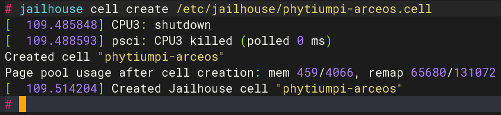

2. 然后加载 ArceOS 的 Loader 程序以及 ArceOS 镜像：`jailhouse cell load 1 /usr/local/libexec/jailhouse/arceos-loader-phytiumpi.bin /usr/local/libexec/jailhouse/demos/arceos.bin -a 0xb2000000`。这里的 1 是指的我们上面创建的 Non-root Cell 的 ID，也可以使用 Cell 的名字（注意是 Cell 中定义的 name，不是文件名）。
    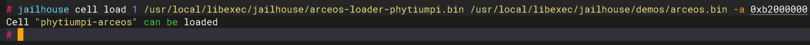

3. 最后启动 ArceOS：`jailhouse cell start 1`
    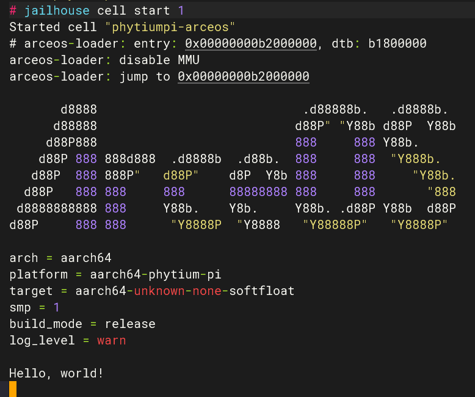

#### 启动 Linux
飞腾派上引出了 UART1 和 UART2 两个串口的接口，因此我们可以分别作为 Linux 宿主机的控制台和 linux 客户机的控制台。在此之前，使用命令 `stty -F /dev/ttyAMA2 speed 115200 cs8 -cstopb -parenb -echo` 初始化串口2。

1. 将 Image 和 rootfs.cpio 复制到开发系统中
2. 执行如下命令，启动 Linux。注意替换 Image 和 rootfs.cpio 的路径
    ```bash
    jailhouse cell linux -d /etc/jailhouse/dtbs/phytiumpi-linux.dtb \
    -i /usr/local/libexec/jailhouse/demos/rootfs.cpio \
    -c "console=ttyAMA1,115200 earlycon=pl011,0x2800e000 root=/dev/ram0 loglevel=8 pci=nomsi" \
    /etc/jailhouse/phytiumpi-linux.cell \
    /usr/local/libexec/jailhouse/demos/Image
    ```
    启动之后，我们就会在串口 2 上收到 Linux 的启动日志了

    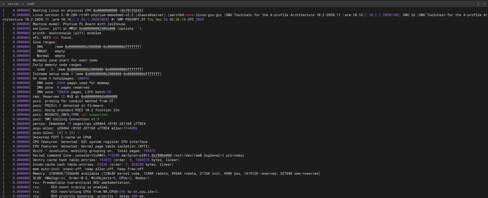

#### 关闭 Jailhouse

直接使用命令 `jailhouse disable` 就可以关闭 Jailhouse。


### 树莓派

注意，ArceOS 和 Linux 只能同时启动一个，因为默认提供的镜像中给他们分配了相同 CPU 和 内存空间！

#### 启动 Jailhouse

首先直接 `jailhouse enable /etc/jailhouse/rpi4.cell` 就可以启动 Jailhouse。启动后，当前 Linux 系统就会称为 Root Cell。

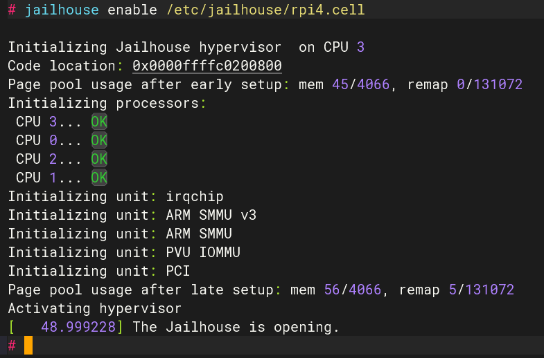

#### 启动 ArceOS

1. 首先创建 ArceOS 对应的 Cell：`jailhouse cell create /etc/jailhouse/rpi4-arceos.cell`。执行后一个 Non-root Cell 就创建好了
    

2. 加载 ArceOS 的 Loader 程序以及 ArceOS 镜像：`jailhouse cell load 1 /usr/local/libexec/jailhouse/arceos-loader-raspi4.bin /usr/local/libexec/jailhouse/demos/arceos.bin -a 0x42000000`。这里的 1 是指的我们上面创建的 Non-root Cell 的 ID，也可以使用 Cell 的名字（注意是 Cell 中定义的 name，不是文件名）。
    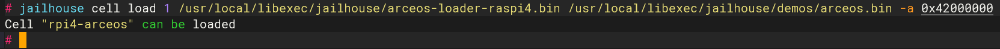

3. 启动：`jailhouse cell start 1`
    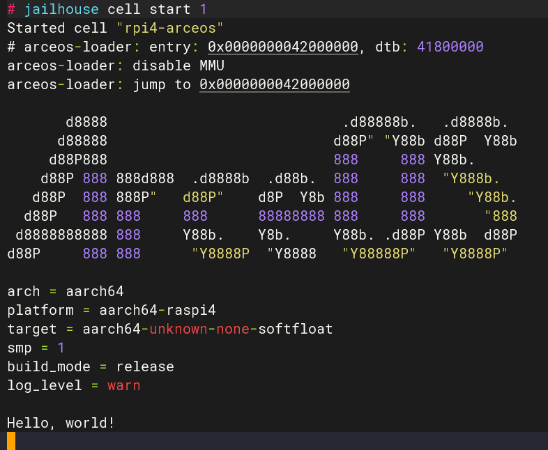

#### 启动 Linux

树莓派上只引出了一个串口接口，因此我们只能让Linux 宿主机和 linux 客户机共用一个控制台

1. 将 Image 和 rootfs.cpio 复制到开发系统中
2. 执行如下命令，启动 Linux。注意替换 Image 和 rootfs.cpio 的路径
    ```bash
    jailhouse cell linux -d /etc/jailhouse/dtbs/rpi4-linux.dtb \
    -i /usr/local/libexec/jailhouse/demos/rootfs.cpio \
    -c "console=ttyAMA0,115200 earlycon=pl011,0xfe201000 root=/dev/mem0 loglevel=8" \
    /etc/jailhouse/rpi4-linux.cell \
    /usr/local/libexec/jailhouse/demos/Image
    ```
    启动之后，我们就会在当前控制台上收到 Linux 的启动日志了

    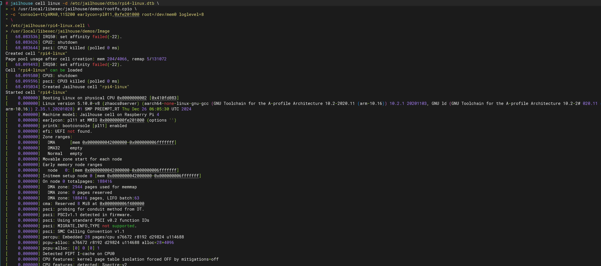

#### 关闭 Jailhouse

直接使用命令 `jailhouse disable` 就可以关闭 Jailhouse。

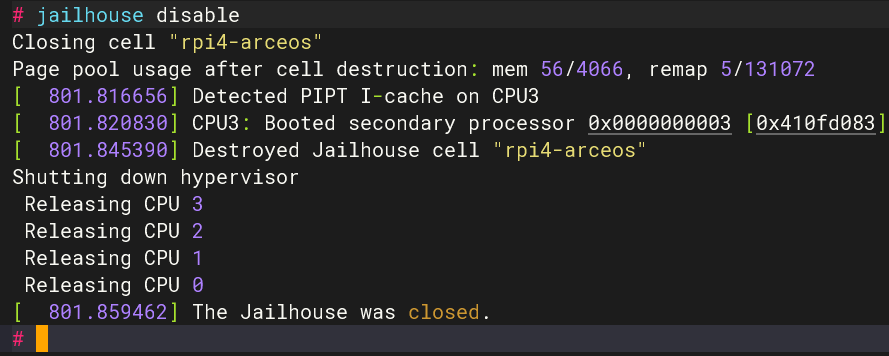
